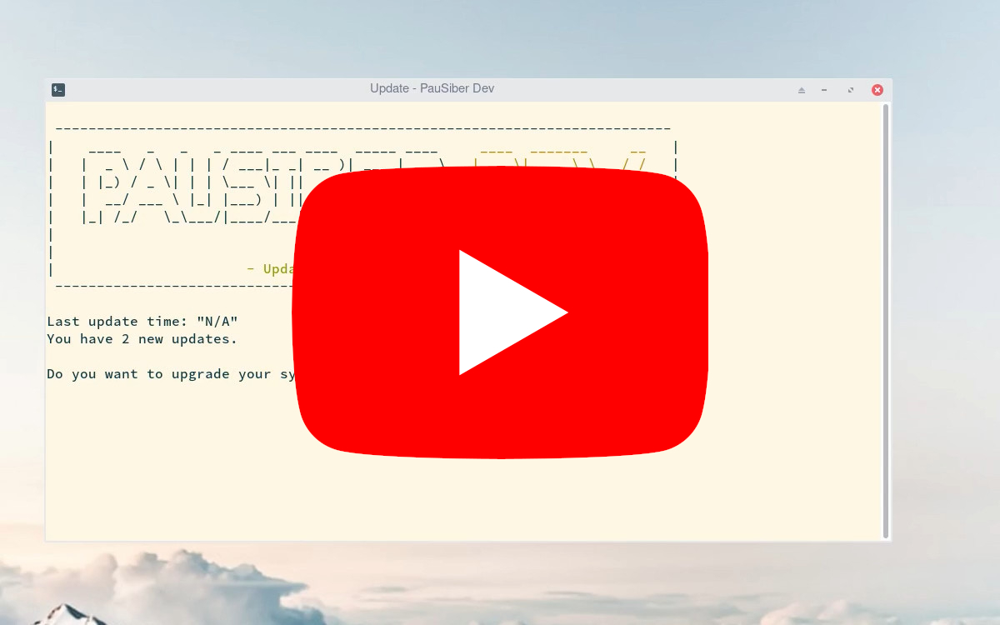

## PauSiber Dev - Update Service

[](https://goreportcard.com/report/github.com/pausiber/update)

> An update service that brings updates from PauSiber team to users.  


You will be up to date.  
You will be getting updates from PauSiber team..

## Features

- Included gvm and go installation script.
- Checking updates on every boots.
- A tiny interface to use.

## Installation

**Hey!**  
If you have already [**PauSiber Dev**](https://dev.pausiber.xyz/).  
Do not worry.

You already have the update system.
Run this command to get magic.
```shell
systemctl start update_dev.service
```

## Usage

[](https://www.youtube.com/watch?v=VgaM_Ejru6o)

## To-Do

- [ ] Add "do all updates" (--no-confirm) to cli.
- [ ] Add notifications for Pacman and Aur updates.
